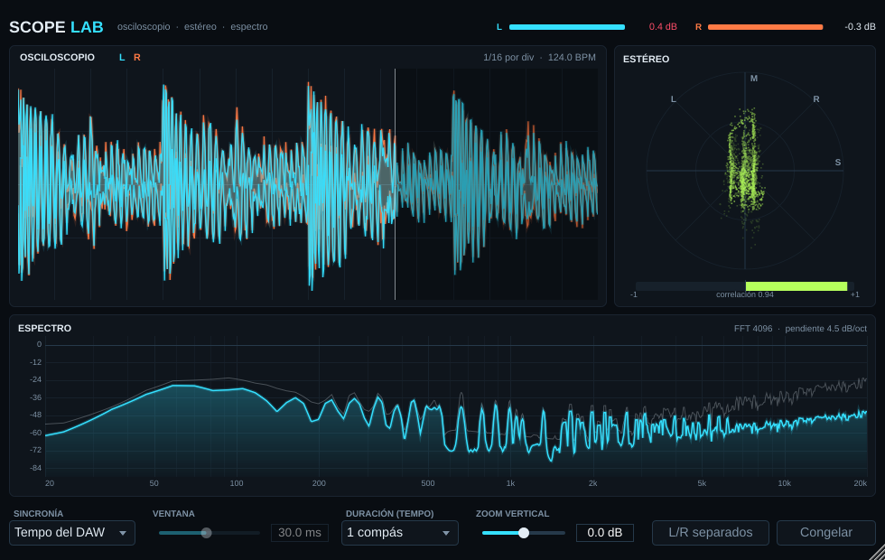

# ScopeLab



Analizador visual en formato VST3 (y AU en Mac): osciloscopio, goniómetro estéreo con medidor de correlación y analizador de espectro. El audio pasa sin modificarse.

## Funciones

- **Osciloscopio** con tres modos de sincronía:
  - *Libre*: muestra la ventana de tiempo elegida.
  - *Trigger*: se engancha al cruce por cero de los graves para que la onda quede quieta.
  - *Tempo del DAW*: la ventana dura 1/4 de tiempo hasta 1 compás y se dibuja con barrido, como un osciloscopio real.
- Vista de **L y R superpuestos** o **separados**.
- **Goniómetro** (Mid/Side) y medidor de **correlación** de -1 a +1.
- **Espectro** FFT 4096 en escala logarítmica, con pendiente de 4.5 dB/oct y línea de picos.
- Medidores de pico L/R, **zoom vertical** y botón **Congelar**.
- La ventana es redimensionable y los ajustes se guardan con el proyecto.

## Conseguir el plugin compilado (sin instalar nada)

1. Creá un repositorio en GitHub y subí esta carpeta (sin `build/` ni `JUCE/`; JUCE se descarga solo).
2. Entrá a la pestaña **Actions**. La compilación arranca sola (tarda unos 10–15 minutos).
3. Cuando termine, abrí la ejecución y descargá **ScopeLab-Windows** o **ScopeLab-Mac** en *Artifacts*.

## Instalar

**Windows:** copiá `ScopeLab.vst3` a `C:\Program Files\Common Files\VST3\` y volvé a escanear plugins en tu DAW.

**Mac:** copiá `ScopeLab.vst3` a `~/Library/Audio/Plug-Ins/VST3/` y `ScopeLab.component` a `~/Library/Audio/Plug-Ins/Components/`. Como no está firmado con certificado de Apple, la primera vez corré en la Terminal:

```
xattr -cr ~/Library/Audio/Plug-Ins/VST3/ScopeLab.vst3 ~/Library/Audio/Plug-Ins/Components/ScopeLab.component
```

## Compilar en tu compu

Necesitás CMake 3.22+ y Visual Studio 2022 (Windows) o Xcode (Mac).

```
cmake -B build -DCMAKE_BUILD_TYPE=Release
cmake --build build --config Release
```

El resultado queda en `build/ScopeLab_artefacts/Release/`.

## Archivos

- `Source/PluginProcessor.*`: captura el audio en un buffer circular sin bloqueos y lee el tempo del DAW.
- `Source/PluginEditor.*`: interfaz y dibujo de las tres vistas (60 cuadros por segundo).
- `Tools/SnapshotMain.cpp`: herramienta opcional que genera capturas con una mezcla de prueba (`-DSCOPELAB_BUILD_SNAPSHOT=ON`).
