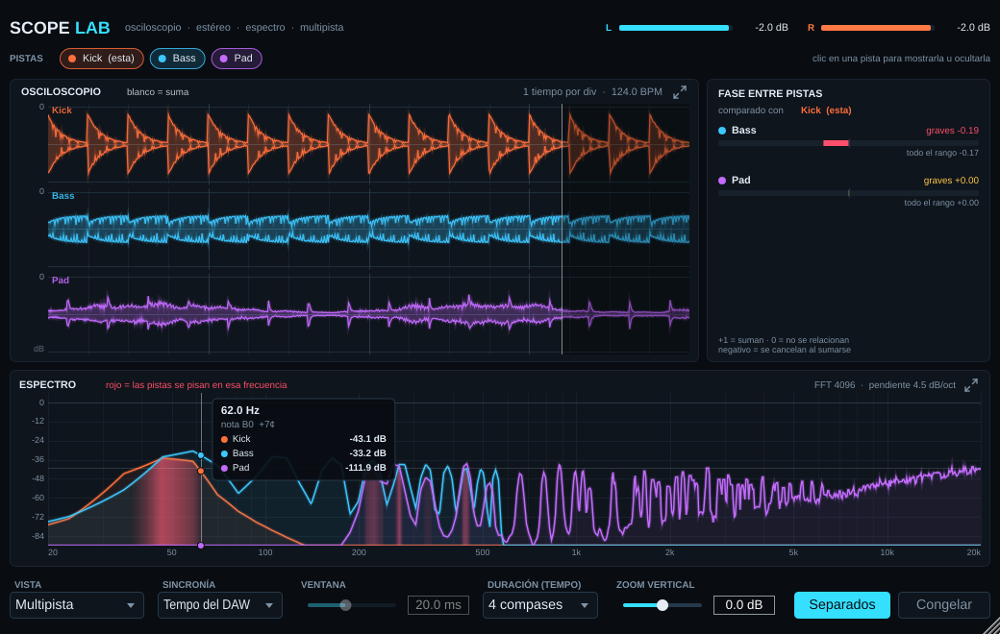

# ScopeLab

Analizador visual en formato VST3 y AU: osciloscopio, goniómetro estéreo y analizador de espectro, con **modo multipista** para comparar varias pistas y ver si se pisan. El audio pasa sin modificarse.

## Modo multipista

Poné ScopeLab en cada pista que quieras comparar (por ejemplo Kick y Bass), abrí cualquiera de ellas y elegí **Vista → Multipista**. Todas las instancias se ven entre sí.

- **Ondas alineadas al tempo**, cada pista con su color, más la **suma** en blanco. Ahí se ve si los golpes coinciden o si una pista le "come" la onda a la otra.
- **Espectro comparado**: en rojo, las frecuencias donde dos pistas tienen mucha energía a la vez (enmascaramiento).
- **Fase entre pistas**: correlación de cada pista contra la tuya, en graves (<150 Hz) y en todo el rango. Si da negativa, al sumarse se cancelan.
- Clic en una pista de la barra de arriba para mostrarla u ocultarla.
- **Separados** pone cada pista en su propio carril.

Para que se alineen, el DAW tiene que estar en Play. En Ableton los nombres y colores de las pistas aparecen solos (VST3).

> Importante: usá **el mismo formato en todas las pistas** (todas VST3 o todas AU). Una instancia VST3 no ve a una AU.

## Otras funciones

- **Osciloscopio** con tres modos de sincronía:
  - *Libre*: muestra la ventana de tiempo elegida.
  - *Trigger*: se engancha al cruce por cero de los graves para que la onda quede quieta.
  - *Tempo del DAW*: la ventana dura entre 1/4 de tiempo y 4 compases, y se dibuja con barrido como un osciloscopio real.
- Vista **Esta pista (L/R)** con goniómetro (Mid/Side) y medidor de correlación L/R.
- **Espectro** FFT 4096 logarítmico, con pendiente de 4.5 dB/oct.
- **Escala en dB** en el osciloscopio, que se ajusta sola con el zoom vertical.
- **Lectura con el mouse** en el espectro: frecuencia, nota (C3 = Do central, como Ableton) y nivel de cada pista.
- **Ampliar paneles**: el ícono de flechas de cada panel, o un doble clic, agranda el osciloscopio o el espectro a toda la ventana.
- Duraciones con tempo de **1/4 de tiempo a 4 compases**.
- Medidores de pico, **zoom vertical** y botón **Congelar**.

## Conseguir el plugin compilado

Cada vez que se sube un cambio al repositorio, GitHub lo compila solo:

1. Abrí la pestaña **Actions** y entrá a la última ejecución con tilde verde.
2. Descargá **ScopeLab-Mac** o **ScopeLab-Windows** en la sección *Artifacts*.

## Instalar en Mac

1. En el Finder apretá **Cmd + Shift + G**, pegá `~/Library/Audio/Plug-Ins/VST3` y copiá ahí `ScopeLab.vst3`.
2. Repetí con `~/Library/Audio/Plug-Ins/Components` para copiar `ScopeLab.component`.
3. Como el plugin no está firmado por Apple, abrí la Terminal y pegá:
   ```
   xattr -cr ~/Library/Audio/Plug-Ins/VST3/ScopeLab.vst3 ~/Library/Audio/Plug-Ins/Components/ScopeLab.component
   ```
4. En Ableton, andá a *Preferencias → Plug-ins*, activá VST3 o Audio Units y tocá **Volver a escanear**.

## Instalar en Windows

Copiá `ScopeLab.vst3` a `C:\Program Files\Common Files\VST3\` y volvé a escanear los plugins.

## Compilar en tu compu

Necesitás CMake 3.22 o posterior, más Xcode (Mac) o Visual Studio 2022 (Windows).

```
cmake -B build -DCMAKE_BUILD_TYPE=Release
cmake --build build --config Release
```

El resultado queda en `build/ScopeLab_artefacts/Release/`.

## Archivos

- `Source/ScopeHub.h`: espacio compartido entre instancias, con un lugar por pista (audio, tempo, nombre y color).
- `Source/PluginProcessor.*`: copia el audio sin bloqueos y lee el tempo del DAW.
- `Source/PluginEditor.*`: interfaz, alineación entre pistas y dibujo de las vistas a 60 cuadros por segundo.
- `Tools/SnapshotMain.cpp`: herramienta opcional que simula tres pistas y genera capturas (`-DSCOPELAB_BUILD_SNAPSHOT=ON`).
